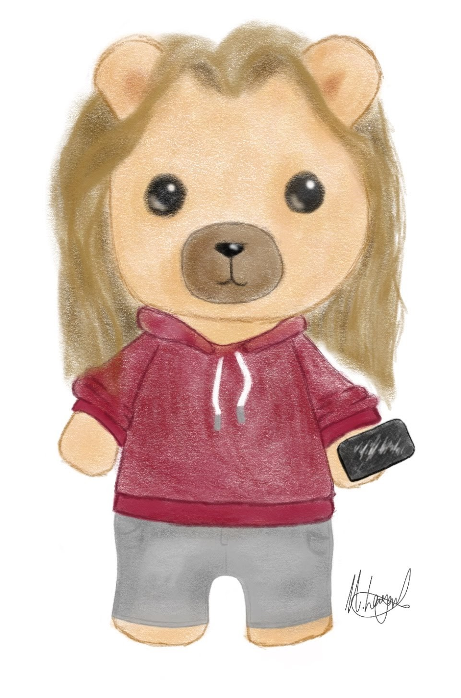

  

<h1  align="center">Hi 👋, I'm Matt</h1>

<h3  align="center">Platform Engineer and amateur Python wrangler</h3>

<code>pronouns = ["him", "he", "they"]</code>

I like to pretend I can write code here, I build cloud deployments in the real world and I'm much better at that.
 

Please don't hesitate to ask me about Platform Engineering, DevOps, Python, PowerShell, Amazon Web Services, Serverless, CI/CD, or anything else you think I can help you with!

---

<h4  align="left">Current Work</h4>

- 💼 I primarily work full time at [LIMA Networks](https://www.lima.co.uk) as a Cloud Consultant in the Optimise Team.

- 🏎️ My main side project is working on indexing and searching all ClickDealer car dealerships to find my next car. 

- 🕹️ I have also contributed to [SwitchRoot](https://gitlab.com/switchroot) on GitLab assiting with DevOps and CI/CD.

- ✈️ When not writing code, I'm designing and building various types of RC aircraft and fly freestyle FPV multirotors.

<h4  align="left">Aircraft Fleet</h4>

- Mini Skyhunter V2 - Ardupilot equipped, fully autonomous - Autonomous Fixed Wing Development Aircraft (3S)
- Flywoo Explorer LR 4 - iNav equipped, semi autonomous - Long-range Multirotor Cruiser (4S)
- TBS Source One V4 - EmuFlight equipped, no autonomy - Designed exclusively for Freestyle FPV (6S)
- Eachine Tyro79 - Betaflight equipped, no autonomy - 3" FPV Racing Drone (3S)
- NewBeeDrone AcroBee Lite - Betaflight equipped, no autonomy - Miniature short-range indoor FPV multirotor (1S)

<h4  align="left">Notable Work</h4>

-  🎉 First pull request to a public open-source project  🎉
	- [cdr/code-server](https://github.com/cdr/code-server) Kubernetes Helm Chart - [PR](https://github.com/cdr/code-server/pull/2048)

-  🔧 Maintainer of [matthew-beckett/netxms-dockerfiles](https://github.com/Matthew-Beckett/netxms-dockerfiles) and upstream maintainer of [netxms/netxms-dockerfiles](https://github.com/netxms/netxms-dockerfiles) 🔧

<h4  align="left">Contact Me</h4>

- 📫 Email: **matt@beckett.cloud**

-   </a> Keybase: **matt_beckett**
